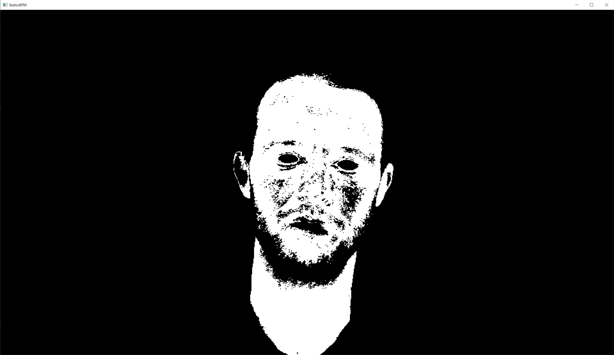

Here’s the code we used in [my video with Steve Mould]() to extract his heart rate from a video of his face!

It’s very much hacked-together-for-a-video level code, but it does run. If you’d like to clean this up and make it slightly more usable, please feel free to make a pull request. :)

## How to use `stattohr.py`

- You’ll probably need to install a few Python libraries to make this work, see the `import` statements at the top of the script.
- Run it with `python stattohr.py -f filename.mp4` to extract the heart rate from a file.
- It will start by displaying random frames from the video so you can pick a skin colour. Click somewhere on the face, and then press A to show the ‘chroma key’ it’s using, which will display a terrifying black and white image like this:  This is looking good—it’s selected most of Steve’s skin!
- Press O for ‘OK’, and it will go through taking the average of the skin-coloured pixels and storing it for processing later. You can press A again which has the dual benefit of making it less terrifying to watch, and speeding things up a bit because it can just display the straight video.
- Once it’s gone through the whole video, it will display a few graphs to check everything worked. These show the raw RGB values (not very informative as the main thing you can see is that skin contains more R than G and B!), the RGB values with moving averages subtracted (explained below), and then YUV values with moving averages subtracted (YUV is commonly used when extracting heart rate from skin).
- Close each graph in turn, and then it will automatically start creating output image files with the magnified colour change superimposed on the skin.

## How it works

This code just takes the skin RGB values and subtracts two moving averages: a long-period one of around a second to smooth over gross changes (eg if the subject moves their head) and then a short-period one of a few frames to smooth over how noisy the data usually are and make the output look a bit nicer.

More advanced code uses FFTs to extract heart rate frequencies, or clever machine learning to do the same. I tried the former and found it a bit finicky for use in this video!

## What it doesn’t do

With apologies, there are a bunch of commented out or otherwise unfinished or unusable bits in this code. There are a few missing components for doing this on a live webcam image, but it would be pretty easy to implement. There’s also some code at the bottom which is commented out which just runs a ‘Welch’ analysis to get frequencies from the smoothed RGB data. This works really surprisingly well! But it’s also far slower than real-time, so I actually did this when I got home, and it never made it into the video anyway. :) It would be pretty easy to make this work either optionally after analysing the video or with the relevant command line flag.

## How to use `ppg-plots.R`

This is just a few simple `ggplot` graphs to show the data more beautifully. It’s meant to be run interactively in RStudio, just for checking stuff out purposes.

It also includes the (very simple!) code to import a file from [Polar Sensor Logger](https://play.google.com/store/apps/details?id=com.j_ware.polarsensorlogger) which is what we used to get the ECG from the Polar H10.

## Credits

Inspired by [pyVHR](https://github.com/phuselab/pyVHR) which implements a load of algorithms to extract heart rate in a far more general way than this script does!